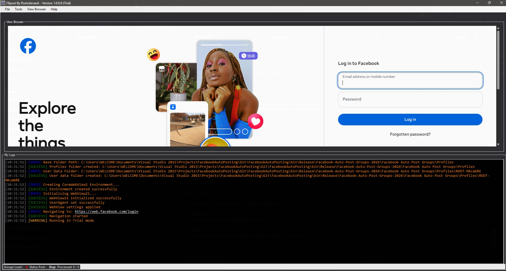

# 🚀 FACEBOOK AUTO POST GROUPS

---

## 📌 Description

**Facebook Auto Post Groups** is a Windows-based application designed to help users distribute content to Facebook groups automatically, quickly, and efficiently.

This tool simplifies the posting process, eliminating the need to manually post to each group one by one.

---

## 🎯 Key Features

With this application, you can:

- Automatically share and post content to Facebook groups  
- Promote products, services, or portfolios (e.g., CV in image format)  
- Save time by avoiding repetitive manual posting  

All processes are handled automatically to improve your workflow and productivity.

---

## ⚙️ How to Use

1. Run the `.exe` file  
2. Log in to your Facebook account through the application  
3. Enter your group list  
4. Add your post content  
5. Click **Start Auto Post**  

---

## 📥 Download

Download the application from the link below:

👉 https://poetralesana.my.id/fbpost

---

## 📷 Preview

> 

---

## ⚠️ Important Information

Some antivirus programs may detect this application as a **false positive**.  
This may happen due to the protection mechanisms used within the application.

If this occurs:
- Add the application to your antivirus **whitelist**
- Ensure you download only from the official source

---

## 🔒 Security

- Does not store passwords directly  
- Uses WebView-based session (cookie login)  
- Includes input validation to prevent errors/crashes  

---

## 💖 Support / Donation

If this application helps you, your support is appreciated 🙏

- **PayPal**  
  https://www.paypal.com/paypalme/poetralesana  

- **DANA**  
  https://poetralesana.my.id/images/aaa%20kasian%20aaaa/dana.jpg  

---

## 🌐 Social Media

- Facebook  
  https://web.facebook.com/162829401111203/  

- YouTube  
  https://www.youtube.com/@DeveloperNgantuk  

---

## ⭐ Support

If you like this project, don’t forget to give it a **Star** ⭐ on GitHub.

---

## ⚠️ Disclaimer

Use this application responsibly and in accordance with the platform’s policies.  
Any risks arising from usage are the responsibility of the user.

---

🔥 *Automation made simple & efficient!*